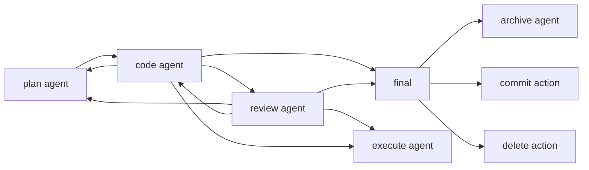
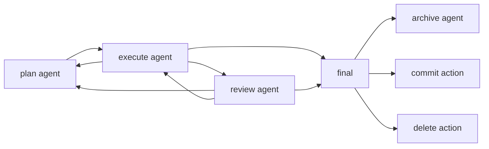

# MeowFlow

`MeowFlow` is a workflow for automated coding rather than vibe coding.

This project is based on [Paseo][paseo] and [OpenSpec][openspec]. Paseo provides the agent runtime, interfaces, and orchestration surface. OpenSpec provides the roadmap, specification, and task-driven structure that guides the workflow.

## Installation

MeowFlow runs on Paseo's daemon, app clients, and CLI runtime. Paseo manages
existing agent CLIs, so install and authenticate at least one supported agent
first:

- [Claude Code](https://docs.anthropic.com/en/docs/claude-code)
- [Codex](https://github.com/openai/codex)
- [OpenCode](https://github.com/anomalyco/opencode)

MeowFlow currently targets modified Paseo source that is not included in
prebuilt Paseo releases. See [Paseo installation](docs/PASEO-INSTALLATION.md)
for the source checkout steps and upstream citation.

Install `mfl` with one of these options:

1. From npm:

   ```bash
   npm install -g meow-flow
   ```

2. From this checkout with `pnpm link`:

   ```bash
   pnpm --filter meow-flow run build
   cd packages/meow-flow
   pnpm link --global
   ```

## Get Started

```text
mfl install-skills codex
mfl worktree new
/meow-flow Create a echo hello script.
```

`/meow-flow` and `/mfl` are the entry skills. They inspect `mfl status`, launch
the first plan agent in a linked Git worktree, and coordinate later stages
through persisted thread state and handoffs.

For a small human-verified change, the minimal path can be:

```text
/meow-flow add a focused CLI help example
/mfl code
/mfl delete
```

That path plans, implements, and then deletes the temporary open proposal
artifacts while keeping the code changes. Review remains available with
`/mfl review`, but it is not mandatory for simple changes the human verifies
directly.

## Philosophy

`MeowFlow` follows a staged workflow:

1. Research / Explore stage: start by understanding the problem space and deciding what should exist before trying to build it. At this stage, you either write a roadmap to define direction and milestones, or write specs directly when the target is already clear enough.
2. Planning stage: split roadmap items into concrete specs and keep those specs updated as the work becomes better understood. The goal of planning is to turn broad intent into scoped, actionable tasks that can guide implementation without ambiguity.
3. Coding stage: implement according to the tasks defined in the specs instead of treating coding as an open-ended prompt. This keeps execution aligned with explicit requirements and makes progress easier to track.
4. Reviewing stage: test and debug according to the specs so review feedback stays actionable and tied to expected behavior. Review is not just opinion; it is validation against written requirements and a way to surface concrete gaps.
5. Execute mode: use the variant workflow described below when the work centers on producing scripts, artifacts, and datasets that need repeatable execution and validation.

## Execute Mode

Execute mode is a variant of the Plan-Code-Review workflow with an additional `meow-dataset` concept:

`meow-dataset` refers to repository-local dataset packages and their generated data locations. In practice, a dataset lives under `project/dataset/<dataset-name>/`, keeps generation scripts in `src/gen/`, validation scripts in `src/validate/`, and writes execution logs under `dataset.tmp/logs/`.

1. Planning stage: same as the standard workflow.
2. Execute stage: write scripts to generate, execute, benchmark, or debug project artifacts through these dataset packages, producing repeatable outputs instead of ad hoc files.
3. Validate stage: validate the scripts' output with dataset validators, and make future execution run those validators so datasets continue to satisfy their required format and quality constraints.

## Usage

Start from an installed skill:

```text
/meow-flow implement user authentication
/mfl code add tests too
/mfl review focus on auth edge cases
```

The underlying CLI can also launch staged agents directly:

```bash
mfl run --stage plan "implement user authentication"
mfl run --stage code "implement the approved plan"
mfl run --stage review
```

MeowFlow discovers worktrees with `git worktree list --porcelain`. You can
create worktrees with MeowFlow or with plain `git worktree add`; either way,
`mfl run` can use them.

Thread occupations, agents, request bodies, and handoffs are stored in the
shared SQLite database at `~/.local/shared/meow-flow/meow-flow.sqlite`.

Worktree helpers:

```bash
mfl worktree new                    # creates .paseo-workspaces/paseo-{N+1}
mfl worktree new --branch auth-flow # use a specific branch name
mfl worktree ls                     # alias: mfl worktree list
mfl worktree rm paseo-1             # alias: mfl worktree remove paseo-1
```

Thread coordination commands:

```bash
mfl status
mfl thread status <id> --no-color
mfl thread set name install-auth-flow
mfl handoff append --stage code "implemented auth form; tests passed"
mfl handoff get -n 5
mfl thread archive
```

Plan, code, review transitions:
## Plan, code, review



Plan, execute, validate transitions:



Paseo's CLI remains available for direct agent management:

```bash
pnpm run cli -- ls                           # list running agents
pnpm run cli -- attach abc123                # stream live output
pnpm run cli -- send abc123 "also add tests" # follow-up task

# run on a remote daemon
pnpm run cli -- --host workstation.local:6767 run "run the full test suite"
```

See the [full CLI reference](https://paseo.sh/docs/cli) for more.

## How To Use

For the current `MeowFlow` workflow and usage guidance, see [issue #93](https://github.com/Myriad-Dreamin/meow-team/issues/93).

## Acknowledgement

`MeowFlow` builds on [Paseo][paseo] and [OpenSpec][openspec]. Paseo provides the agent runtime and orchestration surface, while OpenSpec provides the roadmap, spec, and task-oriented structure that this workflow relies on.

[paseo]: https://paseo.sh
[openspec]: https://openspec.dev
