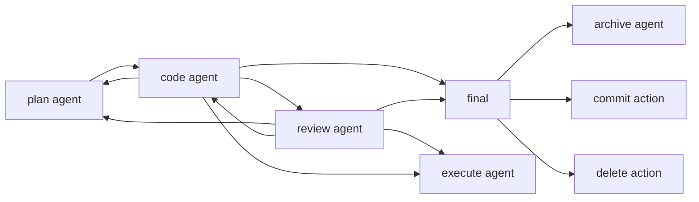
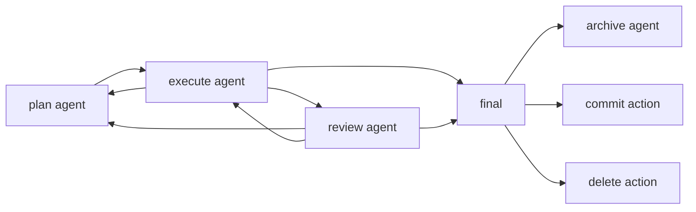

# Interactive mode

Interactive mode starts with the `meow-flow` entry skill. The entry skill uses
`mfl` CLI state to coordinate linked Git worktrees, staged Paseo agents, thread
metadata, and compact handoffs between agents.

These commands are repo-local skills under `.codex/skills`. They are a
conversation convention for agent chats; `mfl` is the persisted coordination
layer. Thread state is stored in the shared SQLite database at
`~/.local/shared/meow-flow/meow-flow.sqlite`.

## Entry commands

| Command | Purpose |
| --- | --- |
| `/meow-flow [content]` | Start or continue a MeowFlow thread. |
| `/mfl [content]` | Alias for `/meow-flow [content]`. |
| `/mfl plan [content]` | Launch a plan stage agent. |
| `/mfl code [content]` | Launch a code stage agent. |
| `/mfl review [content]` | Launch a review stage agent. |
| `/mfl execute [content]` | Launch an execution stage agent. |
| `/mfl validate [content]` | Launch a validation stage agent. |
| `/mfl commit` | Commit current thread changes after reading new handoffs. |
| `/mfl archive` | Archive the thread and OpenSpec proposal. |
| `/mfl delete` | Delete the open proposal artifacts and archive the thread without reverting code. |

Legacy direct role commands still exist: `/meow-plan`, `/meow-code`,
`/meow-review`, `/meow-execute`, and `/meow-validate`. They now use
`meow-flow` for shared thread, worktree, stage, and handoff rules.

## Startup behavior

1. The skill runs `mfl agent update-self` when it is inside a Paseo agent chat.
2. It runs `mfl status`.
3. If the current checkout is the repository root and no worktree is selected,
   it tells the user to create one:

   ```bash
   mfl worktree new
   ```

4. If the current checkout is an idle linked worktree and the user provided a
   request, it launches the initial plan stage:

   ```bash
   mfl run --stage plan "implement user authentication"
   ```

5. If the current checkout is occupied, it reports the thread id or name and
   latest agent id, then asks how to proceed with that thread.

`mfl run` prints `agent-id: <id>` and `next-seq: <seq>`. Continue in the new
agent chat and use `next-seq` when reading only handoffs created after launch.

## Handoffs

Stage agents read thread context with:

```bash
mfl thread status <id> --no-color
mfl handoff get -n 5
mfl handoff get --since <seq>
```

Agents that produce implementation, review, execution, or validation results
append a concise handoff before finishing:

```bash
mfl handoff append --stage code "implemented auth form; vitest auth.test.ts passed"
mfl handoff append --stage review "needs revision; token refresh test missing"
mfl handoff append --stage execute "generated fixture refresh script; output in tmp/data"
mfl handoff append --stage validate "approved; reproduced refresh with pnpm refresh"
```

## Archive and delete

Use `/mfl archive` or `/meow-archive` for the normal archive path: archive the
OpenSpec proposal through the repository workflow, then run `mfl thread
archive` to release the worktree.

Use `/mfl delete` or `/meow-archive delete` for temporary proposal cleanup:
delete the open OpenSpec proposal directory, do not revert code changes, then
run `mfl thread archive`.

## Plan, code, review



## Plan, execute, validate


