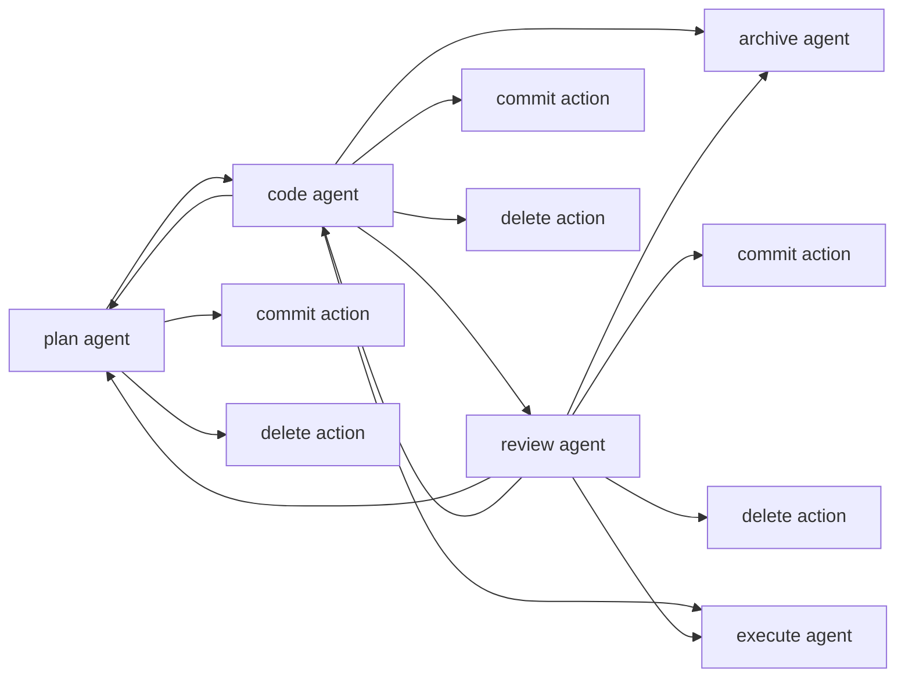
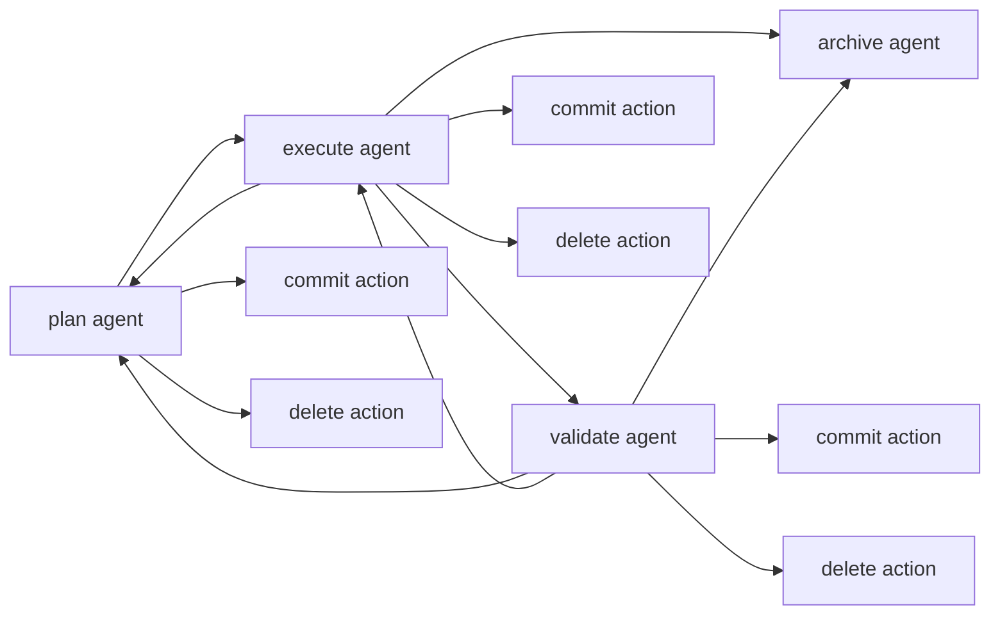

## Context

`mfl install-skills` embeds every repository-local `.codex/skills/meow-*`
directory into `packages/meow-flow/src/embedded-skills.ts`. The existing role
skills are self-contained manual commands, and `team-harness-workflow` is a
generic Codex-only helper that is not embedded because the embed script only
includes `meow-*` directories.

The current `mfl run` command launches `paseo run` in the first linked
worktree and passes the request body through unchanged. It does not persist a
thread name, request body, agent list, handoffs, or archive state. This change
turns the CLI state into the coordination layer that the new skills can read
and update.

## Goals / Non-Goals

**Goals:**

- Make `meow-flow` the shared entry skill for `/meow-flow` and `/mfl`.
- Add `meow-archive` for normal archive and delete-proposal archive flows.
- Keep role-specific behavior in `meow-plan`, `meow-code`, `meow-review`,
  `meow-execute`, and `meow-validate`, but move shared staged-thread behavior
  into `meow-flow`.
- Persist enough thread metadata for any stage agent to discover the request,
  current name, agents, handoffs, and worktree archive state.
- Let `mfl run` start the initial plan agent by default and require
  `--stage` for additional agents after a thread already has agents.
- Support explicit stage launches for `plan`, `code`, `review`, `execute`,
  and `validate` without storing an independent durable stage field.

**Non-Goals:**

- Do not restart or manage the main Paseo daemon.
- Do not replace OpenSpec. The plan agent still creates and commits OpenSpec
  proposal artifacts when the target repository uses OpenSpec.
- Do not automatically run code and review after the initial plan without a
  user action. The entry skill starts the requested stage and lets the user
  continue from the new agent chat.
- Do not revert code changes when `/meow-archive delete` removes the open
  proposal.

## Decisions

### Skill Ownership

Add `.codex/skills/meow-flow/SKILL.md` as the canonical coordination guide.
The core skill documents:

- `/meow-flow [content]` and `/mfl [content]` entry behavior.
- `/mfl plan`, `/mfl code`, `/mfl review`, `/mfl execute`, and
  `/mfl validate` stage dispatch.
- `/mfl commit`, `/mfl archive`, and `/mfl delete` continuation actions when
  the user returns to an older agent chat after a stage agent finishes.
- The expectation that stage agents append compact handoffs with
  `mfl handoff append --stage <stage> <content>` and later agents read recent
  handoffs with `mfl handoff get`.

Update the existing role skills to begin by reading or following the core
`meow-flow` skill for thread status, handoff, and stage rules, then apply their
role-specific planning, coding, review, execution, or validation guidance.
This removes duplicated "harness workflow" sections from role skills while
preserving their role-specific expectations.

Alternative considered: keep `team-harness-workflow` as the shared source and
ask role skills to reference it. That keeps the old name and Codex-specific
framing, but MeowFlow now needs provider-installed `meow-*` skills and slash
commands that map directly to `mfl`, so a `meow-flow` skill is clearer.

### Thread Metadata Model

Extend the existing shared MeowFlow SQLite store at
`~/.local/shared/meow-flow/meow-flow.sqlite` with thread details that can be
rendered as YAML by `mfl thread status <id> --no-color`. The existing
`thread_occupations` rows remain the running-occupation source of truth; this
change adds metadata, agent, and handoff tables alongside them rather than
introducing any repository-local JSON state.

```yaml
name: install-meow-flow-skills
agents:
  - id: 123456
    title: paseo recorded title
    skill: meow-plan
    created: 2026-04-26T00:00:00.000Z
request-body: |
  the original request
handoffs:
  - seq: 1
    stage: code
    content: code diff summary
    created: 2026-04-26T00:00:00.000Z
```

The durable agent record stores the agent id, title, inferred skill, and
created timestamp. It does not store a separate stage column. Stage-oriented
views are derived from the agent skill mapping:

- `meow-plan` -> `plan`
- `meow-code` -> `code`
- `meow-review` -> `review`
- `meow-execute` -> `execute`
- `meow-validate` -> `validate`
- `meow-archive` -> `archived`

Handoff records do store their explicit `stage` because the handoff describes
the producing stage and can be read independently from the producing agent.

Alternative considered: store the selected stage on every agent row. That is
simpler to query, but it creates two sources of truth once `mfl agent
update-self` infers the actual skill from the running agent. Deriving stage
from skill keeps the stored model closer to what Paseo labels and agent
environment metadata provide.

### Run Behavior

`mfl run [request-body]` keeps the existing thread allocation behavior for the
first agent in an idle worktree, but the request body is now stored as the
thread request body and the launched agent receives a stage-specific skill
prompt. Without `--stage`, `mfl run` starts `plan` only when the thread has no
agents. Once a thread has one or more agents, `mfl run` requires
`--stage plan|code|review|execute|validate`.

When a worktree is occupied, `mfl run` does not allocate another worktree for
that checkout. It reports the occupying thread name and relevant Paseo agent id
so the core skill can ask the user how to proceed with the existing thread.

`mfl run` prints machine-readable lines:

```text
agent-id: 123456
next-seq: 3
```

`next-seq` is one more than the current maximum handoff sequence for the
thread. The new stage agent can use that value to avoid rereading handoffs it
already had at launch.

Alternative considered: let each skill call `paseo run` directly. Keeping all
agent launch behavior in `mfl run` avoids provider-specific prompt drift and
keeps worktree occupancy checks in one place.

### Status And Current Thread Resolution

The core skill starts with `mfl agent update-self` when running inside an agent
chat, then reads `mfl status`. `mfl status` determines whether the current
checkout is:

- a linked MeowFlow worktree occupied by a thread,
- an idle linked MeowFlow worktree,
- the repository root with no current thread, or
- outside a git repository.

If the user is in the repository root and no worktree is available, the skill
suggests `mfl worktree new`. The user-facing term remains "worktree" because
MeowFlow is coordinating Git worktrees directly.

Current thread resolution for `mfl thread set`, `mfl handoff`, and
`mfl thread archive` uses the current worktree first. If the command is run in
an agent context, `mfl agent update-self` can also bind the current Paseo
agent id to the thread before the command reads or mutates state.

### Plan Agent Responsibilities

`meow-plan` gains MeowFlow-specific planning duties when launched by
`mfl run --stage plan`:

- Determine a readable unused kebab-case thread name such as
  `install-meow-flow-skills`, unless the user explicitly asked to keep the
  current branch or name. The name must match
  `^[a-z0-9]+(-[a-z0-9]+)*$`.
- Persist it with `mfl thread set name '<name>'`.
- Create an OpenSpec proposal using that name when the repository uses
  OpenSpec.
- Commit the proposal using a suitable title, respecting
  `git config --local paseo.prompt.title` when set and otherwise reading recent
  main-branch titles to infer the local format. The suggested conventional
  shape is `docs: add proposal <name>`.

The plan agent still stops after proposal creation and waits for user approval
or refinement before implementation starts.

### Archive Behavior

`meow-archive` resolves the current thread, then archives the thread and the
corresponding OpenSpec proposal.

`/meow-archive` performs the normal archive path: archive the OpenSpec change
according to the repository workflow, then run `mfl thread archive` to release
the worktree.

`/meow-archive delete` archives the MeowFlow thread and deletes the open
OpenSpec proposal directory without reverting code changes. This gives users a
clean exit for repositories that do not use OpenSpec, for PR-only flows, or for
quick thread cleanup.

### Documentation Shape

Update `docs/interactive-mode.md` from the current manual-role command guide
into the detailed guide for the `meow-flow` entry workflow. The page should
explain the startup status check, worktree-root guidance, stage-agent
launches, current-thread handoffs, commit/archive/delete actions, and how the
legacy role commands relate to the core skill. Keep command examples short and
operational.

Update the root README with a minimal happy-path example that shows:

```text
/meow-flow <request>
/mfl code
/mfl delete
```

This example intentionally skips review because some changes are small enough
for the human to verify immediately after the code agent finishes. It also
uses delete rather than archive because the proposal is temporary in this path:
the code change remains, but the open proposal artifacts are removed instead
of archived. The docs should still show review and archive as available paths
rather than mandatory steps.

Both `docs/interactive-mode.md` and the root README should include Mermaid
diagrams for the two main transition maps.

Code/review workflow:



Execute/validate workflow:



## Risks / Trade-offs

- [Skill and CLI contracts can drift] -> Keep shared coordination text only in
  `meow-flow`; role skills should reference it for common rules.
- [Deriving stage from skill loses explicit CLI intent if inference fails] ->
  `mfl agent update-self` must report a clear diagnostic when it cannot infer a
  supported `meow-*` skill from environment variables or bounded Paseo label
  metadata.
- [Archive delete can remove proposal artifacts users expected to keep] ->
  Require the explicit `delete` variant and document that code changes are not
  reverted.
- [Agent id parsing depends on `paseo run` output] -> Centralize parsing in
  the Paseo command adapter and add fake-Paseo tests for success and malformed
  output.
- [Worktree terminology can drift] -> Keep skills, docs, diagnostics, and
  command examples using `worktree` consistently.
- [Mermaid diagrams can become stale] -> Keep them in both README and
  interactive-mode docs using the same transition labels from the core
  `meow-flow` skill.

## Migration Plan

1. Add or migrate storage tables for thread names, request bodies, agent
   records, handoffs, and archive timestamps without deleting existing
   occupation rows.
2. Add CLI commands and keep existing `mfl run --id <id> <request-body>`
   behavior compatible for first plan-agent launches.
3. Add `meow-flow` and `meow-archive` source skill directories, update role
   skills, remove `team-harness-workflow`, and regenerate embedded skills.
4. Update `docs/interactive-mode.md`, README usage examples, package README
   usage examples, and targeted tests.
5. Rollback can keep older occupation rows; newer metadata tables are ignored
   by older CLI versions.

## Open Questions

- Should `mfl run --stage plan` allow a new plan agent on an already archived
  thread, or require a fresh thread first?
- Should `mfl status` default to YAML for machine parsing, or keep a human
  summary with a `--json`/`--yaml` option for structured output?
